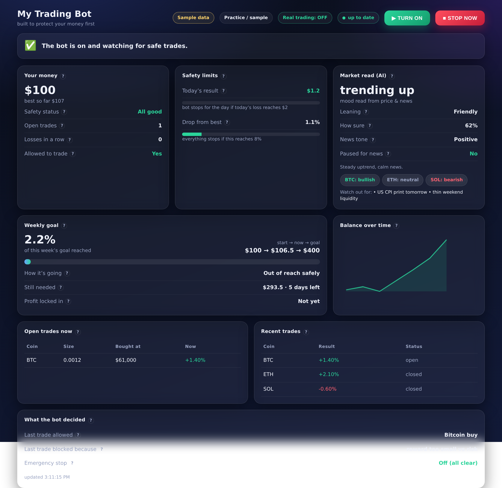

# Autonomous BingX Trading System (paper-first)

An autonomous crypto trading system built on **[Freqtrade](https://www.freqtrade.io/)**
for **BingX spot**, running in **dry-run (paper) mode by default**. An LLM
"research" sidecar writes a market-context signal to Postgres that the strategy
uses as a **soft gate**, and an **independent risk watchdog** can halt the bot
and flatten positions if hard limits are breached.

> ## ⚠️ Capital-loss disclaimer
> Trading cryptocurrency carries substantial risk. **You can lose all of your
> capital.** This software is provided as-is, with no warranty and no promise of
> profitability. It runs in **paper mode by default**; there is **no code path
> that flips it to live trading** — going live is a manual, documented,
> human-only step (see `docs/PHASE4_GO_LIVE_CHECKLIST.md`). Only ever risk money
> you are fully prepared to lose. Nothing here is financial advice.

---

## What's in the box

```
.
├── docker-compose.yml          # postgres + freqtrade + sidecar + watchdog
├── .env.example                # documented env vars (copy to .env; never commit .env)
├── user_data/
│   ├── config.json             # Freqtrade config (BingX spot, dry_run:true)
│   └── strategies/
│       ├── MyStrategy.py        # trend filter + pullback entry + ATR stop
│       └── strategy_logic.py    # pure, unit-tested decision rules + soft gate
├── research/
│   ├── sidecar.py              # scheduled LLM market-context service
│   ├── prompts.py              # hardened classifier prompt (news = untrusted)
│   └── schema.sql              # market_context table
├── risk/
│   ├── watchdog.py             # independent daily-loss / drawdown kill switch
│   └── risk_logic.py           # pure, unit-tested limit rules
├── execution/                  # OPTIONAL live-execution path (REAL MONEY)
│   ├── execution_logic.py      # pure, unit-tested gate + decision validation
│   ├── bingx_api.py            # BingX API (ccxt): account reads + order placement (primary)
│   ├── bridge.py               # FastAPI: Freqtrade webhook -> gate -> order queue
│   ├── executor.py             # queue consumer: API first, browser fallback
│   ├── browser_agent.py        # Playwright/Chromium subagent (fallback order path)
│   ├── live_watchdog.py        # independent live-account halt + flatten (API reads)
│   ├── selectors.py            # centralized BingX UI selectors (verify before use)
│   └── store.py                # Postgres order queue + kill switch + snapshot
├── risk_governor/              # THE trade-approval authority (fail-closed)
│   ├── governor.py             # approve_trade(), kill switch, cooldowns, modes
│   ├── checks.py               # pure, unit-tested risk checks
│   ├── config.py / models.py / alerts.py / audit.py
├── weekly_target_manager/      # aspirational weekly target (never forced)
│   ├── manager.py / calculations.py / models.py / config.py
├── trade_pipeline.py           # Weekly Target Manager → Risk Governor (final)
├── risk_config.json            # all risk values (RG_* env overrides)
├── weekly_target_config.json   # weekly target values (WT_* env overrides)
├── dashboard/                  # polished risk dashboard (server.py + static UI)
├── docs/RISK_GOVERNOR.md · docs/WEEKLY_TARGET.md · docs/BROWSER_EXECUTION.md
├── docs/PHASE4_GO_LIVE_CHECKLIST.md
└── tests/                      # 138 tests: strategy, watchdog, sidecar,
                                #   execution, risk governor, weekly target
```

## Capital-protection architecture (risk-first)

> *A mediocre strategy with excellent risk management beats an "AI genius" with
> poor discipline.* The system is built around that principle. The order of
> priority is: **avoid liquidation → protect capital → respect stops → respect
> daily/weekly loss limits → avoid overtrading → lock profit → pursue the weekly
> target only when risk allows.**

```
Strategy Engine → Weekly Target Manager → Risk Governor (FINAL) → Execution → BingX
```

- **No order reaches BingX without `RiskGovernor.approve_trade()`** approving it.
  The governor fails **closed**: missing/stale data, unconfirmed stop-loss, API
  failure, or unknown state → reject and (where needed) halt. See
  [`docs/RISK_GOVERNOR.md`](docs/RISK_GOVERNOR.md).
- **Risk-based position sizing** (size from stop distance, never fixed), max
  leverage 2 / isolated-only, anti-martingale & no averaging-down, spread /
  slippage / volatility filters, risk:reward ≥ 1.5, trade-quality score ≥ 75,
  duplicate-order protection, account reconciliation, cooldowns, and an
  emergency **kill switch** that latches and requires manual restart.
- **Weekly Target Manager** tracks an *aspirational* 4x weekly target, locks
  profit as gains accrue, runs adaptive safe modes, caps trade frequency, and
  **never forces the target or overrides the governor**. See
  [`docs/WEEKLY_TARGET.md`](docs/WEEKLY_TARGET.md).

### Dashboard



A polished dark/glassmorphism dashboard (`dashboard/`) shows the risk-governor
status, weekly-target progress, loss-limit gauges, the LLM regime/sentiment,
positions, equity, and a prominent **STOP** button (trips the shared kill
switch + Freqtrade `/stop`). It renders with demo data out of the box:

```bash
docker compose up -d dashboard    # http://localhost:8050
```

### Integration status (honest)

The Risk Governor, Weekly Target Manager, pipeline, and their **138 unit tests**
are complete. The live executor routes every order through the pipeline. For the
governor to *approve* a live order, the strategy must emit a full signal
(stop-loss, take-profit, ATR, leverage, margin mode, max holding time, quality
components) via the webhook `meta`; until it does, the governor **rejects**
incomplete signals — which is the intended fail-closed behaviour.

## Two execution modes

| Mode | What it does | Money | Default |
|------|--------------|-------|---------|
| **Freqtrade dry-run** | Paper trades on live BingX data; full Freqtrade safety stack | Paper | ✅ on |
| **Live browser execution** | A Playwright subagent mirrors decisions onto the live BingX web UI | **REAL** | ⛔ off (opt-in) |

The live browser path is **off by default** and gated behind both the
`LIVE_BROWSER_TRADING_ENABLED` flag and the `live-browser` compose profile.
Because browser-placed orders are invisible to the Freqtrade watchdog, it ships
with its **own** independent gate (pair allowlist, max positions, daily-loss
cap, per-trade stake clamp, fail-closed kill switch) and a **live account
watchdog** that trips the kill switch and flattens on a breach. **Read
`docs/BROWSER_EXECUTION.md` before enabling it — real money is at risk.**

## Design guarantees

1. **No secrets in the repo.** Everything sensitive lives in `.env`
   (git-ignored). The code reads from the environment.
2. **The LLM is *not* in the order path.** The sidecar only writes a
   `market_context` row. The strategy uses it as a **soft gate** that can *block
   or shrink* entries — it can never open or force a trade.
3. **Untrusted news.** All fetched headlines are wrapped as untrusted data; the
   classifier prompt forbids following any instruction embedded in them and
   outputs JSON only. Output is range-checked before storage.
4. **Independent hard risk limits.** The watchdog runs as its own process, so a
   strategy bug cannot bypass it. On breach it calls Freqtrade `/stop`,
   optionally `/forceexit all`, and alerts via Telegram.
5. **Spot only, no leverage. `dry_run` stays `true`** until a human follows the
   Phase 4 checklist.

## Tech stack

Python 3.11+, Freqtrade (official Docker image), CCXT (via Freqtrade),
pandas + pandas-ta, Anthropic Python SDK (model `claude-opus-4-8`),
PostgreSQL/TimescaleDB, Docker Compose. React/Tailwind for the optional Phase 3+
panel.

> Freqtrade's API and exchange support change over time. Check the current
> [Freqtrade docs](https://www.freqtrade.io/en/stable/) and the BingX
> exchange notes at build time rather than relying on memory.

## Quick start (Phase 0 — paper)

```bash
# 1. Configure
cp .env.example .env
#   edit .env: set Freqtrade API user/pass + JWT/WS secrets, Postgres password,
#   ANTHROPIC_API_KEY (for the sidecar), and optionally BingX read keys + Telegram.

# 2. Bring up Postgres + Freqtrade + sidecar + watchdog
docker compose up -d postgres
docker compose up -d freqtrade        # serves FreqUI on http://localhost:8080

# 3. Download historical data for backtesting (inside the freqtrade container)
docker compose run --rm freqtrade download-data \
  --config user_data/config.json --timerange 20240101- \
  --timeframes 1h 4h --pairs BTC/USDT ETH/USDT SOL/USDT

# 4. Start the research sidecar + risk watchdog
docker compose up -d sidecar watchdog
```

Open **http://localhost:8080** for FreqUI (positions, equity, trades, logs, and
a stop control). This is the dashboard for Phases 0–2.

## Backtesting & validation (Phase 1)

Backtest with realistic fees (BingX spot taker ≈ 0.1%) and slippage:

```bash
docker compose run --rm freqtrade backtesting \
  --config user_data/config.json --strategy MyStrategy \
  --timeframe 1h --timerange 20240101-20240601 \
  --fee 0.001 --enable-protections
```

Walk-forward with separate in-sample / out-of-sample windows, then hyperopt
**only** on the in-sample window and evaluate on the held-out window:

```bash
# in-sample hyperopt
docker compose run --rm freqtrade hyperopt \
  --config user_data/config.json --strategy MyStrategy \
  --hyperopt-loss SharpeHyperOptLoss --spaces buy sell \
  --timerange 20240101-20240401 --epochs 100 --fee 0.001

# out-of-sample evaluation with the tuned params
docker compose run --rm freqtrade backtesting \
  --config user_data/config.json --strategy MyStrategy \
  --timerange 20240401-20240601 --fee 0.001 --enable-protections
```

Report **max drawdown, win rate, profit factor, and number of trades** — not
just total return. If out-of-sample results are far worse than in-sample,
**flag overfitting** and re-think before trusting the numbers.

## Risk watchdog

The watchdog (`risk/watchdog.py`) polls the Freqtrade REST API every
`WATCHDOG_INTERVAL_SECONDS`, tracks daily P&L and drawdown from peak equity, and
**halts** the bot when either cap is hit:

- `DAILY_MAX_LOSS_PCT` (default 5% of `TOTAL_CAPITAL_USDT`)
- `MAX_DRAWDOWN_PCT` (default 10%)

On breach it calls `/stop`, optionally `/forceexit all`
(`WATCHDOG_FLATTEN_ON_BREACH=true`), and sends a Telegram alert. It **latches**
in the halted state — a human must restart the bot.

## Tests

The decision rules and risk limits are isolated in dependency-free modules so
they run anywhere:

```bash
pip install -r requirements.txt        # or just: pip install pytest requests
pytest -q
```

These cover the entry/exit signals, the ATR stop math, the LLM soft gate
(including that it can never force a trade), each risk-limit breach, the
watchdog halt/flatten path, and the sidecar's output validation /
prompt-injection hardening.

## Build phases

| Phase | Goal | Accept when |
|------|------|-------------|
| 0 | Env + read-only paper | Live data flows, FreqUI up, no trading logic relied on |
| 1 | Strategy + backtest | Reproducible backtest, out-of-sample evaluated, no look-ahead |
| 2 | Dry-run live (2–4 wks) | Runs unattended; every limit + kill switch demonstrably works |
| 3 | LLM sidecar + panel | Regime updates on schedule; strategy respects `risk_off` gate |
| 4 | Tiny live (manual) | Human follows `docs/PHASE4_GO_LIVE_CHECKLIST.md`; no auto-live path |

## Configuration knobs

See `.env.example` for the full list. Key risk knobs (paper defaults):

| Var | Default | Meaning |
|-----|---------|---------|
| `TOTAL_CAPITAL_USDT` | 1000 | Paper capital (`dry_run_wallet`) |
| `PER_TRADE_STAKE_USDT` | 100 | Per-trade stake (`stake_amount`) |
| `MAX_OPEN_TRADES` | 3 | Concurrent positions |
| `DAILY_MAX_LOSS_PCT` | 5 | Watchdog daily-loss halt |
| `MAX_DRAWDOWN_PCT` | 10 | Watchdog drawdown halt |
| `SIDECAR_INTERVAL_SECONDS` | 120 | LLM research cadence |

> These defaults were chosen so the system is runnable out-of-the-box in paper
> mode. Adjust capital and caps to your own risk tolerance before any live use.
